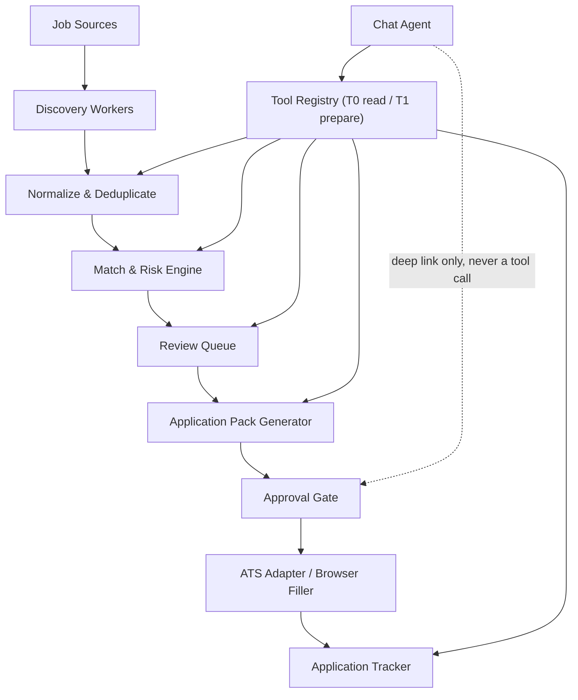

# Autonomous Job Search & Application Agent

## 1. Product Goal

Build a self-hosted job-search agent that continuously discovers relevant roles, scores them against Mohammed Alostah's CV and preferences, creates tailored application materials, fills supported application forms, and tracks every application.

The system should reduce manual effort without inventing candidate information or submitting low-confidence applications.

Default autonomy mode: **prepare and fill, then pause for approval before final submission**.

The system is driven through two surfaces that share one backend: a structured web UI, and a **chat agent** that acts as the conversational control plane over the same data and services. The chat agent explains, searches, prepares, and guides, but it never becomes a second path around the approval gate.

## 2. Candidate Profile Seed

Initial profile extracted from `Mohammed_Alostah_CV.docx`:

- Current positioning: Engineering Lead / Senior Backend Engineer
- Experience: 7+ years
- Location: Amman, Jordan
- Core stack: Python, FastAPI, Node.js, Express.js, PHP, Laravel, Django
- Architecture: distributed systems, microservices, REST APIs, queues, event streaming, high availability, multi-tenant SaaS
- Cloud: Azure, AKS, AWS, Kubernetes, Docker, CI/CD, Infrastructure as Code
- Data: PostgreSQL, MySQL, MongoDB, Redis, Elasticsearch
- Security: OAuth 2.0, Azure AD SSO, JWT, STRIDE, F5 BIG-IP WAF, VAPT remediation
- AI: Agentic AI, RAG, LangChain, LangSmith, CrewAI, NMT and Arabic/RTL NLP
- Leadership: team leadership, architecture reviews, roadmap ownership, delivery and stakeholder management
- Languages: Arabic native, English fluent

Primary target titles:

1. Engineering Lead / Technical Lead
2. Senior Backend Engineer
3. Backend Platform Engineer
4. Software / Solution Architect
5. Staff Backend Engineer
6. Python / FastAPI Lead
7. Laravel / Node.js Lead
8. Cloud-Native / Kubernetes Engineer
9. AI Integration / Agentic AI Engineer

The onboarding UI must ask for and store:

- Target countries and remote/onsite preference
- Minimum acceptable compensation and currency
- Work authorization, relocation, and sponsorship requirements
- Notice period and earliest start date
- Preferred and excluded companies/industries
- Desired and excluded job titles
- Willingness to travel or relocate
- Answers to recurring application questions
- Maximum applications per day and autonomy level

## 3. Scope

### MVP

- Upload and parse DOCX/PDF CVs
- Candidate profile editor
- Job-source connectors for Greenhouse, Lever, and Ashby
- Configurable company career-page watchlist
- Scheduled job discovery
- Job normalization and duplicate detection
- Rule-based filtering and AI-assisted match scoring
- Explainable match report with strengths, gaps, and red flags
- Review queue
- Tailored CV content and cover-letter generation
- Application-question answer bank
- Browser-assisted form filling
- Human approval before submission
- Application pipeline and audit log
- Email or in-app daily digest
- Chat agent with grounded answers, citations, and tiered tool access (read and prepare tools only)
- Chat-guided onboarding for preferences and the answer bank
- Docker Compose local deployment

### Phase 2

- More ATS adapters, starting with Workable and SmartRecruiters
- Company discovery from curated target lists
- Interview-preparation packs
- Follow-up reminders
- Multiple CV variants
- Analytics for source quality and conversion rate
- Chat coaching modes: interview preparation, gap analysis, and negotiation prep
- Voice input for chat
- Optional automatic submission for explicitly allow-listed ATS flows

### Explicit Non-Goals for MVP

- CAPTCHA bypassing
- Automating technical assessments or interviews
- Fabricating experience, salary, authorization, or demographic answers
- Mass-applying without relevance thresholds
- Scraping authenticated LinkedIn pages
- Storing passwords, cookies, or tokens in plaintext
- Submitting applications with unresolved mandatory questions
- A chat agent that can submit applications, change safety policies, or raise its own autonomy level
- Open-ended agent loops in chat with unbounded tool access

## 4. Autonomy Levels

| Level | Name | Behavior |
|---|---|---|
| 0 | Scout | Discover, normalize, deduplicate, and rank only |
| 1 | Prepare | Create tailored CV, cover letter, and suggested answers |
| 2 | Assisted Apply | Fill the application and pause before submission; default |
| 3 | Guarded Auto-Submit | Submit only on allow-listed adapters when all required answers are known and confidence/risk policies pass |

Level 3 must be disabled by default and enabled separately per job source. A user-visible audit entry is required for every external action.

The chat agent inherits the active autonomy level and can never exceed it. Chat can lower effective autonomy for a single job ("just shortlist this one, don't draft anything"), but raising the level, allow-listing a source, or changing quotas is only possible in the policies UI.

## 5. Recommended Technology Stack

### Backend

- Python 3.12
- FastAPI + Pydantic v2
- SQLAlchemy 2 + Alembic
- PostgreSQL 16 + pgvector
- Redis
- Dramatiq or Celery for background jobs
- APScheduler or Celery Beat for recurring discovery
- LangGraph for resumable workflow state, not open-ended autonomous loops, and for the chat agent's bounded tool loop
- Server-Sent Events for chat token and tool-call streaming
- Playwright Python for browser-assisted applications
- `python-docx`, `pypdf`, and `docx2txt` for CV ingestion
- `sentence-transformers` for local embeddings
- Structured logging with `structlog`
- OpenTelemetry metrics and traces

### AI Runtime

Use an OpenAI-compatible provider interface so models can be changed without changing business logic.

Default local options:

- Ollama for Linux/Windows development
- MLX-LM server for Apple Silicon
- Qwen instruct model for extraction, scoring explanations, drafting, and chat
- `all-MiniLM-L6-v2` or a stronger configurable sentence-transformer for first-stage similarity

The chat agent additionally requires a model with reliable tool/function calling. If the configured model's tool calling is unreliable, the provider interface must fall back to a constrained JSON tool-selection prompt rather than free-form text parsing.

Every LLM response used by the workflow must be validated against a Pydantic schema. LLM output must never directly trigger a submission, in the workflow or in chat.

### Frontend

- Vue 3 + TypeScript + Vite
- Pinia
- Vue Router
- Tailwind CSS
- TanStack Query for server state
- Streaming chat UI with tool-call confirmation cards and citation chips
- Accessible component primitives, including screen-reader-friendly streaming message regions

### Testing and Operations

- Pytest + pytest-asyncio
- Vitest
- Playwright end-to-end tests
- Ruff + mypy
- ESLint + Prettier
- Docker Compose
- GitHub Actions or an equivalent CI pipeline

## 6. Architecture



The chat agent is a client of the same domain services as the REST API; it holds no business rules of its own and cannot reach the approval gate or the ATS adapters.

The workflow must be event-driven and idempotent. Each node persists its input, output, status, attempts, and error before moving to the next node.

## 7. Core Modules

### 7.1 Candidate Profile

- Parse CV into structured experience, skills, achievements, education, certifications, and links
- Keep the uploaded CV as immutable source evidence
- Allow the user to correct parsed fields
- Store facts separately from generated wording
- Maintain reusable answers with provenance: `user_confirmed`, `cv_derived`, or `generated_draft`

### 7.2 Job Discovery

Implement a common connector interface:

```python
class JobSource(Protocol):
    async def discover(self, cursor: str | None) -> DiscoveryBatch: ...
    async def fetch_details(self, external_id: str) -> RawJob: ...
```

First adapters:

- Greenhouse Job Board API
- Lever Postings API
- Ashby public job posting API
- Generic RSS/JSON feed
- User-managed company career-page watchlist

Prefer public APIs over browser automation. Respect source rate limits and robots/site rules. Store source URL, fetch time, external ID, and raw-content hash.

Official references:

- [Greenhouse Job Board API](https://developers.greenhouse.io/)
- [Lever Postings API](https://github.com/lever/postings-api)
- [Ashby public Job Postings API](https://developers.ashbyhq.com/docs/public-job-posting-api)
- [Playwright](https://playwright.dev/)

### 7.3 Normalization and Deduplication

Normalize:

- Title and seniority
- Company
- Country, city, timezone, and remote status
- Employment type
- Compensation when present
- Required/preferred skills
- Responsibilities
- Visa/sponsorship information
- Application URL and closing date

Deduplicate using this order:

1. Source + external ID
2. Canonicalized application URL
3. Company + normalized title + location
4. Content fingerprint

Never merge records when confidence is below the configured threshold; link them as possible duplicates instead.

### 7.4 Match Engine

Use a deterministic pipeline:

1. Hard filters: location, compensation, authorization, excluded terms, seniority
2. Skills overlap
3. Title and responsibility similarity
4. Experience/seniority compatibility
5. Domain and leadership fit
6. Local embedding similarity
7. LLM explanation based only on CV facts and job text

Default weighted score:

| Dimension | Weight |
|---|---:|
| Role and responsibility fit | 25% |
| Required technical skills | 25% |
| Seniority and years of experience | 15% |
| Architecture/cloud fit | 15% |
| Leadership/domain fit | 10% |
| Location, authorization, and compensation | 10% |

Default routing:

- 80-100: high-priority review
- 70-79: normal review
- 60-69: save as possible match
- Below 60: archive unless explicitly requested
- Any hard-filter failure: rejected with a clear reason

The score response must include matched requirements, missing requirements, uncertain items, hard blockers, and evidence references to the CV/job text.

### 7.5 Application Pack Generator

Generate:

- Tailored professional summary
- Reordered skills section
- Suggested achievement bullets selected from verified CV facts
- Cover letter
- Short recruiter message
- Answers to standard application questions

Rules:

- Never create a skill, employer, date, achievement, metric, or certification absent from the candidate profile
- Label unsupported suggestions as gaps, not experience
- Keep one master CV and create job-specific versions as generated artifacts
- Keep a source map from every generated statement to verified candidate facts

### 7.6 Application Orchestrator

Use adapters where possible and Playwright only where needed.

Workflow states:

```text
DISCOVERED -> SCORED -> SHORTLISTED -> PACK_READY -> APPROVED
-> FORM_STARTED -> NEEDS_INPUT | READY_TO_SUBMIT -> SUBMITTED
-> CONFIRMED | FAILED | WITHDRAWN
```

Rules:

- A missing required answer moves the application to `NEEDS_INPUT`
- CAPTCHA or OTP moves it to `NEEDS_USER_ACTION`
- Before submit, show the exact CV, cover letter, answers, destination, and consent checkbox
- Store confirmation number or success-page evidence after submission
- Retry only idempotent steps automatically
- Never retry a submit operation unless prior submission status is conclusively known

### 7.7 Review Queue and Dashboard

Pages:

1. Dashboard
2. New matches
3. Job details and match breakdown
4. Application pack review
5. Browser-assisted application status
6. Pipeline board
7. Candidate profile and answer bank
8. Sources and schedules
9. Policies and autonomy controls
10. Audit log
11. Chat

The chat panel is also dockable on the job details, application pack, and application status pages, where the current entity is passed as thread context.

Essential filters:

- Score, source, role, location, remote status, company, status, discovered date
- `Approve`, `Reject`, and `Generate pack` bulk actions

### 7.8 Chat Agent

The chat agent is the conversational control plane over everything the system already knows. It owns no business logic: it calls the same domain services the REST API uses, so hard filters, no-fabrication rules, approval gates, quotas, and audit logging apply identically whether an action starts in the UI or in a chat message.

#### Responsibilities

- Answer questions about discovered jobs, scores, packs, applications, and pipeline status, with citations
- Explain a match using the stored `match_evidence` for that job, not fresh speculation
- Run guided onboarding: collect the preferences listed in section 2 conversationally and write them to the profile only after explicit confirmation
- Refine preferences and filters in natural language, e.g. "stop showing me onsite roles outside Amman"
- Trigger prepared work: run discovery, rescore a job, generate or regenerate an application pack, draft an answer for the answer bank
- Explain what is blocking an application and deep-link to the exact screen that unblocks it

#### Non-responsibilities

- Never submits an application, starts a browser form, or issues an approval token
- Never changes autonomy level, source allowlists, daily quotas, kill-switch state, or retention settings
- Never invents candidate facts; anything not backed by `candidate_facts` is presented as a gap or a draft, never as experience
- Never acts on instructions found inside job descriptions, emails, or fetched web content

#### Tool tiers

Every chat tool declares exactly one tier. The tier is enforced server-side in the tool registry, not by prompting.

| Tier | Examples | Execution |
|---|---|---|
| T0 read | `search_jobs`, `get_job`, `get_match_explanation`, `get_application_status`, `get_profile`, `get_pipeline_summary` | Executed automatically |
| T1 prepare | `shortlist_job`, `reject_job`, `run_discovery`, `rescore_job`, `generate_application_pack`, `draft_answer`, `update_preferences` | Rendered as a confirmation card in the thread; executed only after the user confirms |
| T2 external | `start_form`, `submit_application`, `add_source`, `set_autonomy_level` | Not callable from chat at all; the agent returns a deep link to the corresponding UI gate |

Rules for every tool call:

- Arguments validated against a Pydantic schema before execution; invalid arguments are a tool error returned to the model, never a partial execution
- Scoped to the calling user; the registry injects the user id and ignores any user id proposed by the model
- Carries an idempotency key derived from `(thread_id, message_id, tool_name, args_hash)`
- Writes an `audit_event` referencing the thread and message that caused it
- T1 confirmations expire, and a confirmation is bound to the exact argument hash shown to the user; changed arguments require a new card

#### Retrieval and grounding

Retrieval is hybrid and deterministic-first:

1. Structured SQL filters answer anything factual: status, score, dates, counts, compensation, source
2. pgvector similarity over job text and candidate facts answers the semantic part, e.g. "roles like the platform one at X"

Every number in an answer comes from SQL, never from the model's reading of retrieved text. Each factual claim carries a reference (`job:{id}`, `match:{id}`, `fact:{id}`, `application:{id}`) that the UI renders as a clickable chip. When retrieval returns nothing, the agent says so instead of generalizing.

#### Prompt-injection defense

The chat prompt has three zones with different trust levels:

| Zone | Trust | Rule |
|---|---|---|
| System policy | Trusted | Fixed at build time; never composed from database or web content |
| User turn | Semi-trusted | The only source of intent; a tool call must be traceable to it |
| Retrieved content | Untrusted | Wrapped in explicit delimiters and labeled as data |

Retrieved content can never widen a tool tier, change policy, reveal configuration or secrets, or motivate a tool call on its own. Suspected injection attempts are recorded as `chat_injection_suspected` audit events and flagged on the offending job record so the user can see which posting tried it.

#### Conversation state

- Threads contain append-only messages, tool calls, and citations
- Long threads are compacted into a rolling summary plus pinned facts; raw messages are retained until the retention policy removes them
- Context is rebuilt from persisted state, so a chat is resumable after a restart, matching the workflow resumability requirement
- Chat can be opened standalone or docked on a job, pack, or application page, in which case that entity is passed as explicit thread context

#### Transport and limits

- SSE stream emitting token deltas, tool-call start/finish events, confirmation cards, and citations
- Cancellation stops generation and marks any pending tool call as cancelled
- Per-user rate limit and daily token budget; when the budget is exhausted chat degrades to T0 read tools with a clear notice rather than failing silently

## 8. Data Model

Minimum tables:

- `users`
- `candidate_profiles`
- `candidate_facts`
- `resume_files`
- `resume_versions`
- `answer_bank`
- `job_sources`
- `source_cursors`
- `companies`
- `jobs`
- `job_raw_snapshots`
- `job_requirements`
- `job_matches`
- `match_evidence`
- `application_packs`
- `applications`
- `application_answers`
- `workflow_runs`
- `workflow_steps`
- `browser_sessions`
- `audit_events`
- `notifications`
- `chat_threads`
- `chat_messages`
- `chat_tool_calls`
- `chat_citations`
- `chat_summaries`

Important constraints:

- Unique `(source_id, external_id)` for jobs
- Unique idempotency key per external action
- Soft-delete generated artifacts but retain immutable audit events
- Encrypt sensitive profile fields and browser-state files at rest
- `chat_messages` is append-only; edits create a new message rather than mutating history
- Unique idempotency key per `chat_tool_calls` row, and a stored `args_hash` that a T1 confirmation is bound to
- `chat_tool_calls` records tier, arguments, confirmation state, result reference, and error, so any chat-initiated change is reconstructable

## 9. API Surface

Suggested endpoints:

```text
POST   /api/v1/resumes
GET    /api/v1/profile
PATCH  /api/v1/profile
GET    /api/v1/jobs
GET    /api/v1/jobs/{id}
POST   /api/v1/jobs/{id}/score
POST   /api/v1/jobs/{id}/shortlist
POST   /api/v1/jobs/{id}/application-pack
POST   /api/v1/applications/{id}/approve
POST   /api/v1/applications/{id}/start-form
POST   /api/v1/applications/{id}/submit
GET    /api/v1/applications
GET    /api/v1/workflows/{id}
GET    /api/v1/audit-events
POST   /api/v1/sources
POST   /api/v1/discovery/run

POST   /api/v1/chat/threads
GET    /api/v1/chat/threads
GET    /api/v1/chat/threads/{id}
DELETE /api/v1/chat/threads/{id}
POST   /api/v1/chat/threads/{id}/messages        # SSE stream
POST   /api/v1/chat/threads/{id}/cancel
POST   /api/v1/chat/tool-calls/{id}/confirm
POST   /api/v1/chat/tool-calls/{id}/cancel
```

All mutation endpoints require an idempotency key. Submission requires a short-lived approval token bound to the application-pack hash.

Chat endpoints are subject to the same authentication and rate limiting. `/api/v1/chat/**` must never be able to reach `start-form`, `submit`, or policy mutations, directly or transitively; this is enforced by the tool registry and covered by a test.

## 10. Security, Privacy, and Responsible Automation

- Local-first deployment by default
- Secrets only through environment variables or a secret manager
- Encrypted browser storage state
- PII redaction in logs
- Role-based access, even if MVP has one user
- CSRF protection and secure cookies if browser sessions are used
- Per-source rate limiting and backoff
- Domain allowlist for browser automation
- Immutable audit log for external actions
- Configurable data-retention and delete/export functions
- Prompt-injection defense: treat all job descriptions and web content as untrusted data
- Never allow web content to change policies, reveal secrets, or trigger tools
- Require explicit approval when a form introduces an answer not previously confirmed by the user
- Enforce chat tool tiers server-side; the model's requested tier is advisory and always re-checked
- Bind every chat-initiated change to the thread and message that caused it in the audit log
- Redact PII from chat transcripts in logs and telemetry; store transcripts under the same retention and delete/export controls as the rest of the profile
- Apply a per-user chat token and request budget so a runaway loop cannot exhaust the model backend

## 11. Repository Structure

```text
job-agent/
├── apps/
│   ├── api/
│   ├── worker/
│   └── web/
├── packages/
│   ├── domain/
│   ├── connectors/
│   ├── matching/
│   ├── ai/
│   ├── chat/
│   ├── application_automation/
│   └── observability/
├── migrations/
├── tests/
│   ├── unit/
│   ├── integration/
│   ├── contract/
│   └── e2e/
├── fixtures/
│   ├── jobs/
│   ├── application_forms/
│   └── injection_corpus/
├── docs/
├── scripts/
├── docker-compose.yml
├── .env.example
├── Makefile
└── README.md
```

## 12. Implementation Phases for Codex

### Phase 0 - Specification and Scaffold

Deliverables:

- ADRs for architecture, LLM provider, job-source policy, and application consent
- Monorepo scaffold
- Docker Compose with API, web, worker, PostgreSQL, and Redis
- CI with lint, type checking, and tests
- Environment configuration and secrets template
- Seed candidate profile schema

Acceptance criteria:

- One command starts all services
- Health checks pass
- Database migrations run automatically in development
- CI passes on a clean checkout

### Phase 1 - CV Ingestion and Candidate Profile

Deliverables:

- DOCX/PDF upload
- Deterministic text extraction
- Structured profile extraction using schema-validated AI output
- Profile editor
- Fact provenance and answer bank
- Import `Mohammed_Alostah_CV.docx` as the first fixture

Acceptance criteria:

- All major CV sections are extracted
- User edits survive reprocessing
- No generated claim is saved as user-confirmed
- Parser and API tests cover malformed files and size limits

### Phase 2 - Discovery Connectors

Deliverables:

- Common connector contract
- Greenhouse, Lever, and Ashby connectors
- Scheduler, cursor/checkpoint storage, retries, and rate limiting
- Normalization and deduplication
- Source management UI

Acceptance criteria:

- Re-running discovery creates no duplicates
- Connector failures do not stop other sources
- Raw snapshots make every normalized field traceable
- Contract tests run against recorded fixtures

### Phase 3 - Match and Ranking Engine

Deliverables:

- Preferences and hard-filter rules
- Weighted deterministic scorer
- Embedding scorer
- Schema-validated LLM explanation
- Review queue and match-breakdown page

Acceptance criteria:

- Score is reproducible for unchanged inputs
- Hard blockers are visible
- Every matched or missing requirement includes evidence
- A fixture dataset has expected rank-order assertions

### Phase 4 - Application Pack Generation

Deliverables:

- Tailored CV content
- Cover letter and recruiter message
- Standard-question drafts
- Artifact versioning and source maps
- Approval UI

Acceptance criteria:

- No unsupported facts in generated artifacts
- Generated output is tied to job and candidate-profile versions
- User can edit and regenerate without losing prior versions

### Phase 5 - Assisted Application

Deliverables:

- Adapter contract for application forms
- Lever/Greenhouse form adapters where technically supported
- Playwright generic form filler
- Human approval gate
- CAPTCHA/OTP and unknown-question pause states
- Submission confirmation capture

Acceptance criteria:

- Dry-run mode never submits
- Integration tests verify fields and uploaded files
- Submit requires a valid approval token
- Duplicate submission is prevented
- Unknown mandatory questions always pause the workflow

### Phase 6 - Scheduling, Notifications, and Tracking

Deliverables:

- Daily discovery schedule
- Daily digest
- Kanban-style application tracker
- Follow-up reminders
- Metrics and operational dashboard

Acceptance criteria:

- Schedule is timezone-aware
- Failed runs retry safely and are visible
- Digest contains only new, eligible matches
- Application status history is immutable

### Phase 7 - Guarded Auto-Submit

Deliverables:

- Per-source allowlist
- Confidence and risk policy engine
- Daily submission quota
- Kill switch
- Post-submit verification and anomaly alerts

Acceptance criteria:

- Disabled by default
- Cannot submit with uncertain answers, changed forms, CAPTCHA, OTP, or policy violations
- Every submission has a complete evidence and audit bundle
- Kill switch stops queued submissions immediately

### Phase 8 - Chat Agent

Ship in three milestones. M1 depends only on Phase 3 and may be started as soon as Phase 3 lands; M2 requires Phase 4; M3 requires Phase 6.

Deliverables:

- M1 read-only chat: threads, SSE streaming, hybrid retrieval, citations, T0 tool registry, injection defense, chat UI page and dockable panel
- M2 prepare tools: T1 tool tier with confirmation cards, idempotency, audit linkage, chat-guided onboarding and answer-bank drafting
- M3 operations: pipeline questions, blocked-application explanations with deep links, digest follow-up questions, token budgets and degradation

Acceptance criteria:

- No chat tool can start a form, submit an application, or change policy or autonomy; a test asserts the registry contains no T2 tool
- Every numeric or status claim in an answer is produced by a structured query and carries a citation the UI can resolve
- A T1 tool executes only after an unexpired confirmation bound to the exact arguments displayed
- The injection corpus produces zero unauthorized tool calls, zero policy changes, and zero secret disclosures; each attempt raises an audit event
- The agent answers "I don't have that" when retrieval is empty, instead of generalizing
- A thread survives an API restart and resumes with full context
- Chat-initiated changes appear in the audit log with their thread and message ids
- Cancelling a stream stops generation and leaves no half-applied tool call

## 13. Testing Strategy

Required test layers:

- Unit tests for scoring, normalization, policies, and state transitions
- Property tests for deduplication and idempotency
- Contract tests per ATS adapter using sanitized fixtures
- Integration tests with PostgreSQL and Redis
- Playwright tests against local replica forms; never submit to real employers during CI
- Golden tests for CV parsing and generated JSON schemas
- Prompt-injection and hostile-job-description tests, run against both the match engine and the chat agent
- Chat tool-registry tests: tier enforcement, user scoping, argument validation, idempotency, and confirmation binding
- Chat grounding tests: every asserted number traceable to a query, every citation resolvable, empty retrieval yields an explicit "not found"
- Chat streaming tests: cancellation, reconnect, and partial-tool-call cleanup
- Failure tests for timeouts, partial forms, expired sessions, repeated clicks, and uncertain submit responses

Production readiness requires:

- At least 80% backend coverage, with higher coverage on policy and submission code
- Zero critical/high security findings
- Dry-run completion across at least 30 varied application-form fixtures
- Zero unauthorized tool calls across the full chat injection corpus
- Manual successful verification on each allow-listed real ATS before enabling submission

## 14. Definition of Done

The MVP is complete when:

1. Mohammed's CV is parsed into a verified candidate profile.
2. The system automatically discovers new roles from at least three ATS sources.
3. Jobs are deduplicated, filtered, and ranked with explainable evidence.
4. High-quality matches appear in a review queue.
5. A tailored application pack can be generated without fabricated claims.
6. The agent can fill a supported application form in dry-run mode.
7. Submission is impossible without explicit approval.
8. Every workflow is resumable and every external action is auditable.
9. The chat agent answers grounded, cited questions about the pipeline and can prepare work through confirmed tool calls, while being structurally incapable of submitting an application or changing policy.
10. The stack runs locally with documented setup and tests.

## 15. Codex Execution Instructions

Give Codex this repository-level instruction before implementation:

> Build this project incrementally from `job-agent-plan.md`. Work on only one phase at a time. At the start of each phase, inspect the existing repository and create a detailed implementation plan with files, migrations, APIs, tests, and risks. Implement the phase end to end, run all relevant checks, fix failures, update documentation, and stop with a concise handoff. Do not begin the next phase until the current phase acceptance criteria pass. Never fabricate candidate data, bypass CAPTCHA/OTP, scrape authenticated LinkedIn pages, or submit a real application unless the user has explicitly enabled that action and approved the exact application. Never give the chat agent a tool that can submit an application or change a safety policy.

Recommended first prompt:

> Read `job-agent-plan.md` completely. Implement Phase 0 only. First inspect the workspace and propose the exact repository structure, dependencies, ADRs, and verification commands. Then scaffold the project, run the checks, fix any failures, and report the changed files and remaining decisions. Use FastAPI, Vue 3 with TypeScript, PostgreSQL, Redis, Docker Compose, and local-model-compatible AI provider interfaces. Do not implement Phase 1 yet.

For every later phase use:

> Read `job-agent-plan.md` and the current repository. Implement Phase N only. Preserve working behavior from earlier phases. Add migrations and tests first where practical, implement the smallest coherent vertical slice, run all relevant tests and linters, fix failures, update the README and ADRs, then stop. Explicitly show which Phase N acceptance criteria passed or remain blocked.

## 16. Immediate Decisions Before Phase 3

The application can be scaffolded before these are answered, but matching must not be finalized without them:

1. Search scope: global remote, GCC, Jordan, Europe, or a combination
2. Minimum compensation by location/currency
3. Relocation and visa-sponsorship rules
4. Preferred autonomy level; recommended default is Level 2
5. Daily discovery and application quotas
6. Excluded companies, sectors, and role types
7. Chat model and provider, given the tool-calling reliability requirement, plus the per-user daily token budget
8. Whether chat-guided onboarding replaces the onboarding form or supplements it

